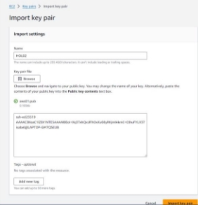
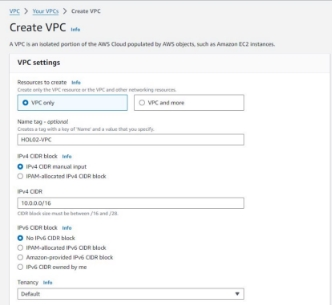
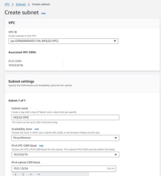
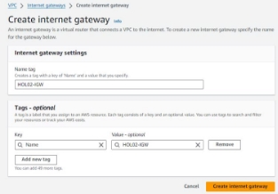
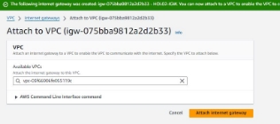
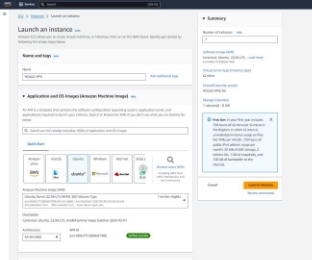
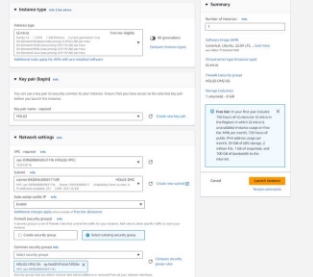
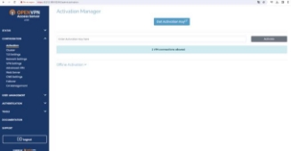
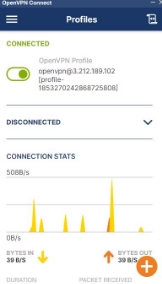

#### UNIVERSITAT ROVIRA I VIRGILI

# Deploying a hybrid infrastructure for researchers in AWS 

#### Isabel Martín Valle                                
#### High-Performance and Distributed Computing for Big Data 

## 1. **INTRODUCTION**

In the world of data science and research, using Jupyter Notebooks has become essential for analyzing data and sharing knowledge. And now, with the growing popularity of the cloud, integrating this technology offers more flexibility, scalability and  access  than  ever  before.  This  report  delves  into  how  to  leverage  Amazon  Web  Services  (AWS)  to  create  a  hybrid infrastructure that facilitates research collaboration. 

The concept of cloud computing allows for easy, on-demand network access to a shared pool of quickly provisioned and released reconfigurable computing resources (such as networks, servers, storage, apps, and services) with little involvement from service providers or management employees. In this case we make use of a hybrid infrastructure that combines on-premises resources with cloud solutions to improve performance, reduce costs, and manage data efficiently.  

In this practice, we focused on setting up a private Jupyter Notebook server on AWS, providing research teams with a secure and scalable environment for working with data. 

In addition, we explore how to integrate a public Nginx web server using Voila, allowing researchers to easily share their findings with a wider audience. Through hands-on exercises, this lab explains in detail how to configure and deploy this hybrid infrastructure to suit the specific needs of each research project. 

## 2. **ARCHITECTURE DIAGRAM AND PROCEDURES**

### ***Architecture diagram*** 

The suggested hybrid infrastructure is shown visually in **Figure 1**. It shows an AWS Virtual Private Cloud (VPC) divided into three subnets: DMZ, Production, and Research. An Internet-accessible EC2 instance called HOL02-VoilaServer is hosted on the Production Subnet. An EC2 instance called HOL02-Jupyter is hosted on the Research Subnet and is reachable through a VPN. An EC2 instance called HOL02-VPN is located in the DMZ Subnet and allows your team to access securely via SSH to the Research subnet.  

<a name="_page0_x54.00_y724.00"></a>. 


**Figure 1.** AWS architecture diagram for deploying a hybrid infrastructure for researchers. Before continuing, the concepts used in this architecture diagram are defined below.  

- AWS Virtual Private Cloud (VPC): it allows the creation of a virtual red in the AWS cloud in isolation. A virtual net is like a digital version of a computer net in the virtual world. 
- Subnet: they are divisions of a bigger net.  
- EC2 Instance: a virtual machine that can execute applications on the website. A virtual machine is software that simulates a physical computer system, allowing multiple operating systems and applications to run on a single physical machine. 
- DMZ subnet: separated net and secured that it is used to proportionate secure access to the Research subnet via VPN.  
- VPN: technology that creates a safe connection between two nets, allowing that the users to access to a private net from a remote ubication.  

### ***Infrastructure setup*** 

#### 1. *Prerequisites* 

First of all, we have to import our public key to AWS EC2 and name it HOL02 to allow a secure access to the EC2 instances based on public keys. This is done by connecting to AWS Academy Learner Lab, pressing Start Lab and search for EC2 -  Key Pairs. Once there, we have to name the key and paste the public key generated in our computer by typing the following command in our terminal:  

``` *ssh-keygen -t type* ```

Once completed the form, we click on import key pair.(**Figure 2)**.  



**Figure 2.** Import key pair. 

#### 2. *VPC* 

An AWS VPC is a virtual network (an isolated portion of the AWS Cloud) that allows to launch resources such as EC2 instances and RDS databases in an isolated environment in the cloud. It provides control over network configuration, such as IP address assignment and routing management. 

To create the VPC, we have to search for VPC and click Create VPC. The VPC settings are displayed below. Any setting not specified it was considered to stay in default configuration.  

*VPC* 

Name: HOL02-VPC CIDR: 10.0.0.0/16 

The CIDR setting determines the range of IP directions that can be assigned to the instances and resources inside this VPC. **Figure 3** shows the settings for this VPC and **Figure 4** shows the resulting VPC created.  



**Figure 3**. Creation of VPC. 


**Figure 4**. Resulting VPC. 

#### 3. *Subnets* 

The subnets are created within the VPC created in the previous step named HOL-02 VPC. Three subnets are created: the DMZ subnet, the Research subnet and the Production subnet. Each subnet will have a different CIDR number. Within the VPC, IP addresses of subnets allow resources to communicate with each other within the private network. Below are the settings for each subnet, if not specified, they stay in default.  

*Subnets* 

Name: HOL02-DMZ CIDR: 10.0.1.0/24 

Name: HOL02-Production CIDR: 10.0.2.0/24 

Name: HOL02-Research CIDR: 10.0.3.0/24 

The following figures shows the creation of the HOL02-DMZ subnet, which shows the setting configured for this subnet (**Figure** 

**5)**. All the other subnets have the same configuration but different name and CDIR. **Figure 6** shows the resulting subnets.  



**Figure 5**. Creation of DMZ subnet. 


**Figure 6.** Resulting subnets created. 

#### 4. *Internet Gateway* 

An internet gateway is a virtual router that connects a VPC to the internet to establish an entrance and exit point for the traffic between the resources of our VPC and the public internet. This is useful to communicate with external resources such as databases or servers. The following settings were set for the internet gateway, all the rest were remained as default (**Figure 7)**.  

*Internet gateway* Name: HOL02-IGW 



**Figure 7.** Internet gateway** configuration. Then, this internet gateway must be attached to the HOL02 VPC (**Figure 8**).  




**Figure 8**. Internet gateway attached to the VPC. 

#### 5. *Route tables* 

When creating subnets within a VPC in AWS, each of those subnets needs an associated routing table (route table). This is necessary because each subnet may have different connectivity requirements. For example, some subnets may need access to the Internet, while others may need access only to resources within the same VPC. By having a dedicated routing table for each subnet, you can define how traffic is routed in and out of that specific subnet. Therefore three Route Tables were created for each subnet with the following configuration.  

*Route Tables* 

Name: HOL02-DMZ-RT Association: HOL02-DMZ 

Name: HOL02-Production-RT Association: HOL02-Production 

Name: HOL02-Research-RT Association: HOL02-Research 

**Figure 9** shows the settings for the first Route Table described. All follow the same default configuration and their specified one. **Figure 10** shows the Resource map for their connections.  


**Figure 9**. Settings for HOL02-DMZ-RT Route Table. 


**Figure 10.** Route Tables connections within the VPC Internet Gateway. 

#### 6. *Security groups* 

Security Groups in AWS are like virtual firewalls that allow you to specify what type of network traffic is allowed or blocked for your cloud instances. When you create a Security Group, you can configure specific rules that determine what types of inbound and outbound connections are allowed. For example, you can allow inbound traffic on port 443 (HTTPS) to allow secure connections to a web server, or allow inbound traffic on port 22 (SSH) to allow remote access to an instance via Secure Shell (SSH). 

The configuration for the security groups for each instance are the following.  

*Security groups* 

Name: HOL02-DMZ-SG Description: Security group for DMZ Ports: 

22 (SSH) 

443 (HTTPS) 

943 (TCP) 

945 (TCP) 

1194 (UDP) 

Name: HOL02-Production-SG Description: Security group for Production Ports: 

80 (HTTP) 

443 (HTTPS) 

22 (SSH) - only from HOL02-DMZ-SG 

Name: HOL02-Research-SG 

Description: Security group for Research Ports: 

22 (SSH) - only from HOL02-DMZ-SG 8888 (TCP) - only from HOL02-DMZ-SG 

**Figure 11, 12,13** show the resulting configuration of the three security groups.  


**Figure 11**. Security group HOL02-DMZ-SG. 


**Figure 12.** Security group HOL02-Production-SG. 


**Figure 13**. Security group HOL02-Research-SG. 

#### 7. *EC2 instances* 

Three  instances  must  be  created,  each  one  located  within  a  subnet  and  with  a  security  group.  The  configuration  was  the following.  Each  instance  had  a  different  AMI.  An  AMI  (Amazon  Machine  Image)  is  a  virtual  template  that  contains  the information needed to launch an EC2 instance on AWS. It includes the operating system, startup data, and any pre-installed software. Moreover, one had an elastic IP. An instance having an Elastic IP means that it has a fixed and permanent public IP address that does not change, which facilitates constant access to the instance from outside AWS. This makes sense to applied to the DMZ instance. 

*EC2 Instances* 

Name: HOL02-VPN Subnet: HOL02-DMZ AMI: Ubuntu 22.04 LTS With elastic IP 

Name: HOL02-VoilaServer Subnet: HOL02-Production AMI: Amazon Linux 2 

Name: HOL02-Jupyter Subnet: HOL02-Research AMI: Amazon Linux 2 

The configuration of each instance was following this same shcmea (used for the HOL02-VPN) but each one with the different settings (**Figure 14**).  





**Figure 14.** Configuration for HOL02-VPN instance. 


**Figure 15**. Instance summary for HOL02-VoilaServer. 

UNIVERSITAT ROVIRA I VIRGILI  9 Isabel Martín Valle 


**Figure 16.** Instance summary for HOL02-Jupyter**.** 

#### 8. *S3 Buckets* 

The "HOL02-Notebooks" bucket in Amazon S3 must be synchronized with the research and production subnets to allow access to notebooks from both environments and ensure consistency of data used by the research team and the production environment. The configuration was the following. 

*S3 Bucket* 

Name: HOL02-Notebooks 

This bucket must include all the notebooks used by the research team. 

**Figure 17** show the bucket created that contains a sample Jupyter Notebook named hol02-app.ipynb. 


**Figure 17**. Bucket HOL02-Notebook with sample Jupyter Notebook. 

### ***Configure all AWS resources*** 

#### 1) *OpenVPN configuration (HOL02-VPN instance)* 

OpenVPN is an open source software solution that provides secure virtual private network (VPN) connections over the public Internet.  OpenVPN  is  installed  on  the  HOL02-VPN  instance  specifically  to  serve  as  a  centralized  VPN  server. The  other instances do not need OpenVPN installed because they act as clients that connect to the VPN server to securely access the private network from external locations. The HOL02-VPN instance is responsible for managing incoming VPN connections and providing secure access to the internal network for the other instances. 

##### *Installation* 

First of all OpenVPN must be installed. This is done by first connecting to the HOL02-VPN instance and then executing the commands above written. To access to the HOL02-VPN instance, we run first the instance and once is running we execute the following command in our terminal (specifying the ID key and the ssh direction specified in the instance summary):  


Once connected these are the commands to install OpenVPN.  
```
sudo apt update -y 

sudo apt install ca-certificates gnupg wget net-tools -y 

sudo wget https://as-repository.openvpn.net/as-repo-public.asc -qO /etc/apt/trusted.gpg.d/as-repo-public.asc sudo echo "deb [arch=amd64 signed-by=/etc/apt/trusted.gpg.d/as-repo-public.asc] http://as- repository.openvpn.net/as/debian jammy main" | sudo tee /etc/apt/sources.list.d/openvpn-as-repo.list 

sudo apt update && sudo apt install openvpn-as -y
```
##### *Configuring OpenVPN* 

- After installing OpenVPN, navigate to the public IP of the EC2 instance named HOL02-VPN and log in using the username openvpn and the password shown in the terminal. The URL should be https://<elastic-ip>:943/admin.  

  In my case the username and password is:  *OpenVPN username and password:*  

  Username: openvpn Password: gW1ipggvezhn 

  **Figure 18** show that we can enter to OpenVPN.  

  

**Figure 18.** We have access to OpenVPN. 

- In the OpenVPN web interface, navigate to Network Settings and change the hostname to the elastic IP. Then, save the changes and reload the page. **(Figure 19**).  

  

**Figure 19.** Network settings. 

- Log in again. Navigate to VPN Settings and add the subnets CIDR one per line. Then, change the Should client Internet traffic be routed through the VPN? to No. Save the changes and reload the page. (**Figure 20**).  

  

**Figure 20**. VPN settings for CIDR and other configurations. 

##### *Installing the OpenVPN client* 

Follow the instructions in the https://<elastic-ip>:943 to install the OpenVPN client on your local machine and download the user-locked profile. There is no need to configure other users in the OpenVPN server. 

**Figure 21** and **22** show the upload and entrance to the user-locked profile which is downloaded when clicking Yourself (user- locked-profile) (**Figure 21**). Then we connect clicking to the windows icon, which downloads OpenVPN in my computer, and then we can access by using the same password proportionated before **(Figure 22**).  


**Figure 21.** OpenVPN access server**. Figure 22**. connected OpenVPN profile. 

Take into account that when we want to connect to the VPN instance, we must first connect to the OpenVPN and then jump to this instance.  

#### 2) *Configuring Nginx (HOL02-VoilaServer instance)* 

Nginx is software that helps to display websites on the Internet quickly and securely. It is installed on the Voila Server instance to ensure that Voila applications are accessible from the web efficiently. 

To install this, first we must connect to the VoilaServer instance. This is done by accessing the Private Network. nce the VPN Client is connected, use the private IP address of the EC2 instance to access the network, not the public IP. The VPN routes traffic to the subnets in the range of, 10.0.2.X, as previously configured. We access via ssh as ssh -i yourkey ec2-user@10.0.2.X where X is the private IP.  

Once done, the following commands are executed in the terminal (**Figure 23**).  
```
\# For Amazon Linux 2 

sudo amazon-linux-extras install nginx1 -y sudo systemctl start nginx 

sudo systemctl enable nginx 
```


**Figure 23**. Inside the instance and all executed for Nginx installation. 

#### 3) *Jupyter Notebook setup (HOL02-Jupyter)* 

First of all, we must enter via Private Network to the HOL02-Jupyter instance via ssh. This is done as before but with the 10.0.3.X direction and after the connection to the OpenVPN. Once done, we must install and configure python, this is done by executing the following commands.  

- Update the instance before installing new Software 

```sudo yum update -y ```

- Make an installation script and run it:  

```vi install-python39.sh```
```
#!/bin/bash 

PYTHON\_VERSION=3.9.0 

PYTHON\_TAG=$(echo $PYTHON\_VERSION | cut -d. -f1-2) 

sudo yum install -y gcc openssl11-devel bzip2-devel libffi-devel sqlite-devel 

wget https://www.python.org/ftp/python/$PYTHON\_VERSION/Python-$PYTHON\_VERSION.tgz tar -zxvf Python-$PYTHON\_VERSION.tgz 

cd Python-$PYTHON\_VERSION 

sudo ./configure --enable-optimizations 

sudo make altinstall 

if [ -f "/usr/local/bin/python${PYTHON\_TAG}" ]; then 

sudo ln -sf "/usr/local/bin/python${PYTHON\_TAG}" /usr/bin/python3 

fi 

"/usr/local/bin/python${PYTHON\_TAG}" -m pip install --upgrade awscli --user "/usr/local/bin/python${PYTHON\_TAG}" -m pip install --upgrade pip 

cd .. 

sudo rm -rf Python-$PYTHON\_VERSION 

sudo rm -rf Python-$PYTHON\_VERSION.tgz
```

```bash install-python39.sh ```

- Creating a virtual environment and activate it.  

```python3.9 -m venv jupyter-env source jupyter-env/bin/activate ```

- Installing Jupyter Notebook (upragrading pip to avoid warnings)  pip install jupyter 

```pip install --upgrade pip ```

- Create directory for the notebooks 

```mkdir notebooks ```

```cd notebooks ```

##### *Configuring aws* 

Before continuing, it is important to set the aws configuration. This is done first by running aws configure in the terminal, then paste  the  credentials  for  keys  and  setting  the  region  to:  us-east-1.  Then  running  the  command  aws  configure  set aws\_session\_token with the paste token of the session.  

Once done this, we can run Jupyter Notebook in the background using the following command:  

```nohup  jupyter  notebook  --ip=0.0.0.0  --notebook-dir=/home/ec2-user/notebooks  --no-browser  >  /home/ec2- user/notebooks/jupyter.log  2>&1 & ```

To access the Jupyter Notebook using the browser, we need to run it in the background and then use the private IP address of the EC2 instance like in my case: http://10.0.3.40:8888 

This will then appear in the browser (**Figure 24)**:  

![ref1]

**Figure 24.** Jupyter Notebook in the browser. 

In this figure, it can also be seen that we have created an Untitled Jupyter Notebook to install the boto3 and pandas libraries via pip, then import and configure the libraries needed to interact with AWS S3 in the us-east-1 region **(Figure 25**). 


**Figure 25.** Configuration of AWS S3. 

#### 4) *Automate the synchronization with cron* 

We want to schedule each Sunday at 0:00 a synchronization with cron to update the system. To do so, this command is run in each instance.  

```echo "0 0 \* \* 0  sudo yum update -y" | crontab - ```

The return message is none:  


**Figure 26**. Autmatization with cron. 

***Synchronization of S3 bucket*** 

1) *Synchronization with HOL02-Jupyter instance* 

The following command must be run in the HOL02-Jupyter machine notebook folder:  


**Figure 27.** Syncronization with HOL02-Jupyter. 

2) *Synchronization with HOL02-VoilaServer instance* 

Firstly, the same aws configuration as HOL02-Jupyter instance must be done. And a notebook folder must be created. Once inside we run this command:  


**Figure 28.**  Synchronization with HOL02-VoilaServer 

## 3. VERIFICATION AND COMPLETION TESTS

To verificate that everything was working properly, I connected first to the OpenVPN:  




**Figure 29**. OpenVPN connected. Then, connected first to the HOL02-VPN instance via public IP (elastic IP) ssh:  


**Figure 30**. HOL02-VPN working properly. Then, without closing the OpenVPN, to the Jupyter and Voila instances via private IP:  


**Figure 31.** Connecting properly to the instances. 

Checking that the bucket was synchronized seeing the Jupyter Notebook sample was inside the instance:  


**Figure 32**.S3 bucket synchronized. 

Checking if we have access to the Jupyter Notebook via browser by running Jupyter Notebook in the background of the HOL02- Jupyter instance:  

![ref1]

**Figure 33.** Jupyter Notebook running correctly. With all this, we can assure that everything is working correctly.  

## 4. TROUBLESHOOTING

1st issue: Accessing the Private Network: 

The problem consisted in the difficulty of connecting to the HOL02-VoilaServer to configure Nginx, understanding that I should first connect to the HOL02-VPN via SSH and then jump to the HOL02-VoilaServer. I was doing this using the public IP. However, when I tried to do this, as is logical because of the configuration of the IPs made, I encountered an error that prevented the connection. 

**Figure 34.** Error in accessing the Private Network.

- Resolution: The solution is to use the private IP address of the EC2 server once the VPN client is connected, as the VPN routes traffic to the subnets in the range of 10.0.1.X, 10.0.2.X and 10.0.3.X. Therefore, the network should be accessed using this private IP address instead of the public IP, which will solve the connection problem. 

**Figure 35**. Resolution of 1st issue.

2nd issue: Synchronization with S3 Bucket 

When trying to synchronize the S3 Bucket with the HOL02-Jupyter instance, the following error occurred which was fatal and the command was not completed:  

**Figure 36**. Error in synchronizing the S3 bucket. 

- Resolution: The reason of this error was that the region was not found. This is because I left as None the region of the aws configure command. To resolve this, aws configure must be run again, introduce the keys and srt the region as us- east-1 (the same ones as the instances and the bucket).  

## 5. CONCLUSIONS

The report details the step-by-step deployment of a hybrid infrastructure on AWS, addressing the configuration of private Jupyter servers and public Nginx servers to share research results. Personally, this project has given me an insight into setting up a VPC and understanding the fundamentals of cloud computing, a new experience for me. As I faced challenges and solved bugs, my understanding of the VPC architecture deepened, highlighting a continuous and meaningful learning process in dealing with these emerging technologies. 

## REFERENCES

- AWS Academy Learner Lab 
- Biomedical Data Science Master - URV 

[ref1]: Aspose.Words.595b23d4-1dcd-4225-b137-80362058195e.027.png
